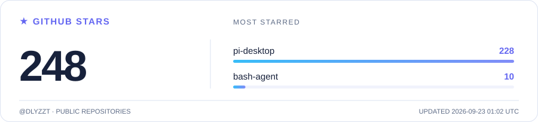

<picture>
  <source media="(prefers-color-scheme: dark)" srcset="assets/header-dark.svg" />
  <source media="(prefers-color-scheme: light)" srcset="assets/header-light.svg" />
  
</picture>

  把 AI 变成真正用得上的工具。 
  AI agents · Desktop experiences · Developer tools

  <a href="https://github.com/DLYZZT?tab=repositories">探索项目</a> &nbsp; / &nbsp;
  <a href="https://pi-desktop.app">Pi Desktop 官网</a> &nbsp; / &nbsp;
  <a href="https://github.com/DLYZZT/pi-desktop/issues">交流想法</a> &nbsp; / &nbsp;
  <a href="https://x.com/dlyzzt">𝕏 @dlyzzt</a>

## Agent

### [Pi Agent Desktop](https://github.com/DLYZZT/pi-desktop)

一个本地优先的 AI 桌面工作台。把对话、项目文件、浏览器、Skills 和消息渠道放在一起，让 Agent 融入日常工作。

  TypeScript / React / Electron &nbsp; · &nbsp; macOS / Windows / Linux

**[下载体验 ↗](https://github.com/DLYZZT/pi-desktop/releases/latest)** &nbsp; · &nbsp; [查看源码](https://github.com/DLYZZT/pi-desktop) &nbsp; · &nbsp; [反馈问题](https://github.com/DLYZZT/pi-desktop/issues)

### [Bash Agent](https://github.com/DLYZZT/bash-agent)

面向命令执行的智能 Agent，让终端成为 AI 的工作空间。

  Python &nbsp; · &nbsp; CLI Agent

[查看源码](https://github.com/DLYZZT/bash-agent) &nbsp; · &nbsp; [反馈问题](https://github.com/DLYZZT/bash-agent/issues)

## 小工具

<table>
  <tr>
    <td width="50%" valign="top">
      <h4>☀ &nbsp; <a href="https://github.com/DLYZZT/china-weather-mcp-server">China Weather MCP</a></h4>
      
接入高德天气 API，让 AI 助手通过 MCP 查询中国城市的实时天气。

      
PYTHON &nbsp; / &nbsp; MCP

    </td>
    <td width="50%" valign="top">
      <h4>◎ &nbsp; <a href="https://github.com/DLYZZT/llm-council-webui">LLM Council</a></h4>
      
群英荟萃，模型开会。让多个模型独立作答、互评，再汇总答案。

      
PYTHON &nbsp; / &nbsp; MULTI-MODEL

    </td>
  </tr>
  <tr>
    <td width="50%" valign="top">
      <h4>◷ &nbsp; <a href="https://github.com/DLYZZT/agent-token-usage">Agent Token Usage</a></h4>
      
从本地会话日志统计多个 Coding Agent 的 Token 用量，无需 API Key。

      
RUST &nbsp; / &nbsp; LOCAL-FIRST

    </td>
    <td width="50%" valign="top">
      <h4>⇄ &nbsp; <a href="https://github.com/DLYZZT/surge-mcp-server">Surge MCP Server</a></h4>
      
通过 MCP 连接 Surge HTTP API，让 AI 工具接入代理控制能力。

      
JAVASCRIPT &nbsp; / &nbsp; MCP

    </td>
  </tr>
</table>

## GitHub Stars

<a href="https://github.com/DLYZZT?tab=repositories">
  <picture>
    <source media="(prefers-color-scheme: dark)" srcset="assets/github-stars-dark.svg" />
    <source media="(prefers-color-scheme: light)" srcset="assets/github-stars-light.svg" />
    
  </picture>
</a>

## 技术栈

<picture>
  <source media="(prefers-color-scheme: dark)" srcset="assets/stack-dark.svg" />
  <source media="(prefers-color-scheme: light)" srcset="assets/stack-light.svg" />
  
</picture>

 
 

<picture>
  <source media="(prefers-color-scheme: dark)" srcset="assets/github-snake-dark.svg" />
  <source media="(prefers-color-scheme: light)" srcset="assets/github-snake.svg" />
  
</picture>

  一点点想法，一点点代码，让工具更好用一点。 
  Build something useful. Then make it better.

